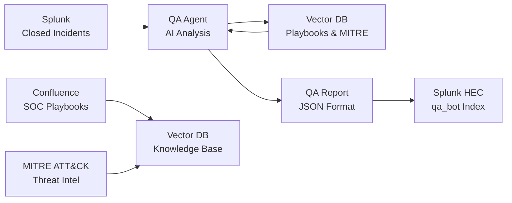

# SOC QA Agent

A localized AI-powered agent that automatically reviews closed security incidents from Splunk, generates quality assurance reports using local LLM analysis, and stores the results back to Splunk for monitoring and improvement.

## Overview

The SOC QA Agent automates the quality assurance process for security incident response by:

- **Retrieving** closed notable events from Splunk SIEM
- **Analyzing** incident response quality using local AI (Ollama LLM)
- **Cross-referencing** against SOC playbooks and MITRE ATT&CK framework
- **Generating** structured QA reports with scores and recommendations
- **Storing** results back to Splunk for dashboard visualization

## Simplified Workflow



## Key Features

- **Automated Processing**: Hourly review of closed security incidents
- **AI-Powered Analysis**: Local LLM (llama3:8b) for consistent, private analysis
- **Knowledge Integration**: SOC playbooks and MITRE ATT&CK framework context
- **Structured Output**: JSON reports with scoring and recommendations
- **Splunk Integration**: Reports stored in dedicated `qa_bot` index
- **Self-Updating**: Monthly MITRE ATT&CK knowledge base updates


## Prerequisites

- Python 3.9+ with pip
- Ollama installed with llama3:8b model
- Splunk instance with HTTP Event Collector (HEC) enabled
- SOC playbooks (PDF format) or Confluence access
- MITRE ATT&CK knowledge base (automatically downloaded)

## Quick Start

1. **Install Dependencies**
   ```bash
   pip install -r requirements.txt
   ```

2. **Configure Settings**
   ```bash
   cp config/secrets.py.template config/secrets.py
   # Edit config/secrets.py with your Splunk HEC credentials
   ```

3. **Build Knowledge Base**
   ```bash
   # For PDF playbooks (recommended)
   python scripts/confluence_to_vector_db.py
   
   # For MITRE ATT&CK data
   python scripts/mitre_attack_loader.py
   ```

4. **Run QA Agent**
   ```bash
   # Test with last hour of incidents
   python scripts/soc_qa_agent.py
   
   # Run for specific time window
   python scripts/run_long_window.py --earliest "-24h" --latest "now()"
   ```

## Configuration

The agent uses the following configuration files:

- `config/settings.py` - General application settings
- `config/secrets.py` - Splunk HEC credentials and API keys
- `data/prompt.txt` - LLM prompt template for QA analysis

## Output

QA reports are generated in JSON format and sent to Splunk's `qa_bot` index via HEC. Each report includes:

- Incident scoring (1-5 scale)
- Playbook compliance analysis
- MITRE ATT&CK context
- Recommendations for improvement
- Evidence-based summary

## Troubleshooting

- Ensure Ollama is running: `ollama serve`
- Check Splunk HEC connectivity and index permissions
- Verify vector database files exist in `vector_db/` directory
- Review logs in `logs/soc_qa_agent.log`
