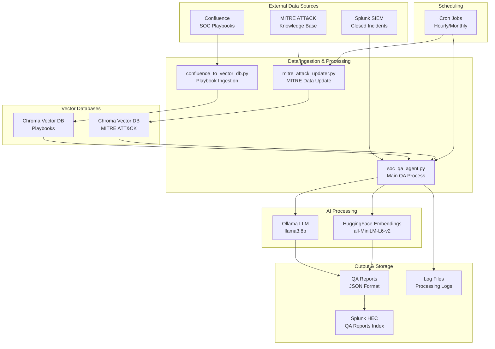
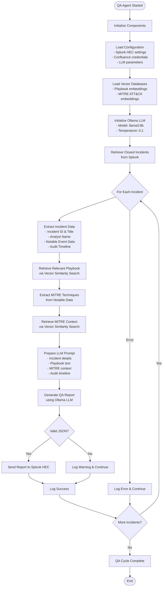
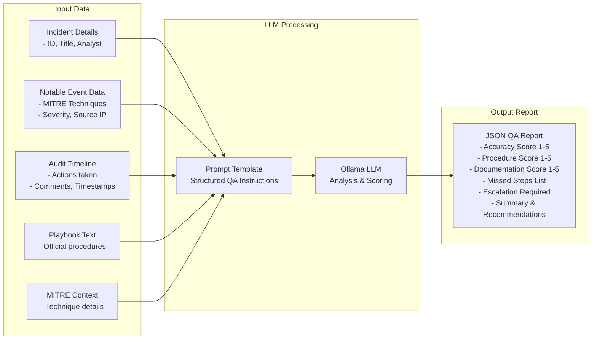

# Security QA Agent Data Processing Flow

## System Architecture Overview

## Detailed Data Processing Flow

## Knowledge Base Update Flow

```mermaid
flowchart TD
    subgraph "Monthly MITRE Update"
        A1[Cron Trigger<br/>Monthly] --> A2[Check Last Update]
        A2 --> A3{Update Needed?}
        A3 -->|Yes| A4[Fetch MITRE ATT&CK Data<br/>via mitreattack-python]
        A3 -->|No| A5[Skip Update]
        A4 --> A6[Process Techniques<br/>to Documents]
        A6 --> A7[Create Embeddings<br/>HuggingFace all-MiniLM-L6-v2]
        A7 --> A8[Update Vector DB<br/>Chroma]
        A8 --> A9[Record Update Time]
    end
    
    subgraph "Initial Playbook Setup"
        B1[Manual Run] --> B2[Connect to Confluence<br/>using API credentials]
        B2 --> B3[Load Playbook Pages<br/>from SOC space]
        B3 --> B4[Split Documents<br/>1000 char chunks]
        B4 --> B5[Create Embeddings<br/>HuggingFace all-MiniLM-L6-v2]
        B5 --> B6[Store in Vector DB<br/>Chroma]
    end
```

## QA Report Structure

## System Components

| Component | Purpose | Technology |
|-----------|---------|------------|
| **Data Sources** | Incident data, playbooks, threat intel | Splunk, Confluence, MITRE |
| **Vector Storage** | Semantic search for relevant content | Chroma DB |
| **Embeddings** | Convert text to vectors | HuggingFace all-MiniLM-L6-v2 |
| **LLM** | Generate QA reports | Ollama (llama3:8b) |
| **Scheduling** | Automated execution | Cron jobs |
| **Logging** | Process monitoring | Python logging |

## Key Features

1. **Automated QA Review**: Processes closed incidents hourly
2. **Knowledge Base Integration**: Uses Confluence playbooks and MITRE ATT&CK
3. **AI-Powered Analysis**: Local LLM for consistent, private analysis
4. **Structured Output**: JSON reports for easy integration
5. **Splunk Integration**: Reports stored back in Splunk for dashboards
6. **Self-Updating**: Monthly MITRE ATT&CK knowledge base updates
